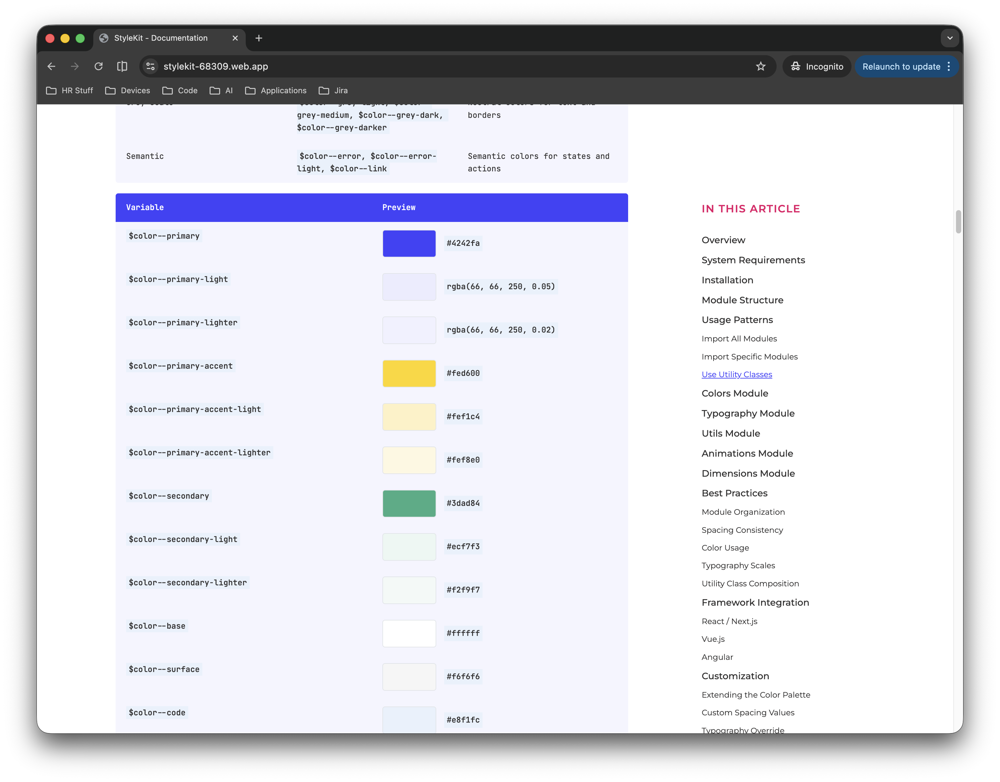

# StyleKit



A comprehensive, modular SCSS design system providing colors, typography, animations, utilities, and layout dimensions for building consistent, beautiful user interfaces. Built with CSS Modules support and designed for modern web applications.

**[View Full Documentation](https://stylekit-68309.web.app/)**

## Overview

StyleKit is a production-ready SCSS design system that provides a complete set of design tokens, utility functions, and pre-built styles for rapid UI development. It ensures style consistency across your application while maintaining flexibility for customization. Built with modern SCSS features, it works seamlessly with any framework or build tool that supports SCSS and CSS Modules.

## Features

- **Comprehensive Color System**: Primary, secondary, accent, semantic, and grayscale colors with variants
- **Typography Scale**: Font families, sizes, weights, line heights, and utility classes
- **Spacing System**: 0-9 scale with utility functions and classes for margins and padding
- **Layout System**: Responsive containers, page layouts, and dimension utilities
- **Animation Library**: Pre-built keyframe animations for common UI patterns
- **Utility Functions**: rem/em converters, spacing functions, and helper utilities
- **CSS Modules Ready**: Full support for scoped styling with CSS Modules
- **Framework Agnostic**: Works with React, Vue, Angular, Next.js, and more
- **TypeScript Friendly**: Designed for modern tooling and development workflows
- **Responsive Design**: Built-in breakpoints and responsive utilities

## Installation

```bash
npm install @san-siva/stylekit
# or
yarn add @san-siva/stylekit
# or
pnpm add @san-siva/stylekit
```

### Requirements

- Sass >= 1.50.0
- CSS Modules support in your build tool
- Any modern framework (React, Vue, Angular, etc.) or vanilla JavaScript

## Quick Start

### 1. Import Global Styles (Optional)

Import the global stylesheet in your application entry point for base styles and resets:

```tsx
// app/layout.tsx or _app.tsx
import '@san-siva/stylekit/styles/globals.scss';
```

### 2. Import SCSS Modules

Import StyleKit modules in your component styles:

```scss
// components/Button.module.scss
@use '@san-siva/stylekit/styles/colors.module.scss' as colors;
@use '@san-siva/stylekit/styles/utils.module.scss' as utils;

.button {
  background-color: colors.$color--primary;
  padding: utils.space(2);
  border-radius: utils.rem(8);

  &:hover {
    background-color: colors.$color--primary-light;
  }
}
```

### 3. Use Utility Classes

Import utility classes in your components:

```tsx
import styles from '@san-siva/stylekit/styles/index.module.scss';

export function MyComponent() {
  return (
    <div className={styles['margin-bottom--3']}>
      <h1 className={styles['font-size--h1']}>Welcome</h1>
      <p className={styles['margin-top--2']}>Get started with StyleKit!</p>
    </div>
  );
}
```

## Documentation

Comprehensive documentation is available at [https://stylekit-68309.web.app/](https://stylekit-68309.web.app/)

The documentation includes:

- Complete module reference with all variables and utilities
- Visual examples and color swatches
- Code examples for every feature
- Best practices and usage patterns
- Framework integration guides (React, Vue, Angular)
- Customization and theming guide
- Performance optimization tips

## Module Overview

### Colors Module

Comprehensive color palette with semantic naming:
- **Primary Colors**: Main brand colors with light variants
- **Accent Colors**: Highlight and emphasis colors
- **Secondary Colors**: Supporting brand colors
- **Semantic Colors**: Error, success, warning states
- **Greyscale**: Light through dark grey tones
- **Base Colors**: Background and surface colors

```scss
@use '@san-siva/stylekit/styles/colors.module.scss' as colors;

.alert {
  background: colors.$color--error-light;
  border-left: 3px solid colors.$color--error;
}
```

### Typography Module

Complete typographic system with:
- **Font Families**: Rubik, Montserrat, JetBrains Mono
- **Font Sizes**: h1-h6, paragraph, small (with utility classes)
- **Font Weights**: 400-800 (with utility classes)
- **Line Heights**: Large, normal, small

```scss
@use '@san-siva/stylekit/styles/typography.module.scss' as type;

.heading {
  font-family: type.$font-family--secondary;
  font-size: type.$font-size--h2;
  font-weight: type.$font-weight--700;
}
```

### Utils Module

Utility functions and spacing system:
- **Functions**: `rem()`, `em()`, `space()` converters
- **Spacing Scale**: 0-9 (4px to 96px)
- **Margin/Padding Classes**: All directions with scale support

```scss
@use '@san-siva/stylekit/styles/utils.module.scss' as utils;

.card {
  padding: utils.space(3);      // 24px
  margin-bottom: utils.space(4); // 32px
  border-radius: utils.rem(8);   // 0.5rem
}
```

### Dimensions Module

Layout and responsive utilities:
- **Containers**: Flexible container classes
- **Page Layout**: Max-width page containers
- **Border Radius**: Scale from 4px to 32px
- **Breakpoints**: Mobile, tablet, and desktop

```scss
@use '@san-siva/stylekit/styles/dimensions.module.scss' as dims;

.card {
  border-radius: dims.$border-radius--2;
}
```

### Animations Module

Pre-built keyframe animations:
- `loading_animation` - Background position animation
- `MoveInTop` - Slide in from bottom
- `fadeInDown` - Fade in from top
- `fadeUp` - Fade up with offset

```scss
@use '@san-siva/stylekit/styles/animations.module.scss';

.modal {
  animation: MoveInTop 0.3s ease-out;
}
```

## Package Exports

The package provides multiple entry points for flexible imports:

```
@san-siva/stylekit/styles/index.module.scss     - All modules
@san-siva/stylekit/styles/colors.module.scss    - Colors only
@san-siva/stylekit/styles/typography.module.scss - Typography only
@san-siva/stylekit/styles/utils.module.scss     - Utils only
@san-siva/stylekit/styles/dimensions.module.scss - Dimensions only
@san-siva/stylekit/styles/animations.module.scss - Animations only
@san-siva/stylekit/styles/globals.scss          - Global styles
```

## Examples

StyleKit is used in production on these sites:

- **[StyleKit Documentation](https://stylekit-68309.web.app/)** - Interactive documentation site
- **[Blogkit Documentation](https://blogkit-c367c.web.app/)** - Component library docs
- **[Gitsy](https://gitsy-56895.web.app/)** - Blog application
- **[Personal Portfolio](https://santhoshsiva.dev)** - Developer portfolio

## Works Great With

StyleKit is designed to work seamlessly with [@san-siva/blogkit](https://www.npmjs.com/package/@san-siva/blogkit) for building beautiful blog interfaces with consistent styling.

## Browser Support

StyleKit supports all modern browsers:
- Chrome (latest)
- Firefox (latest)
- Safari (latest)
- Edge (latest)

## Contributing

Contributions are welcome and appreciated. To contribute:

1. Fork the repository
2. Create a feature branch (`git checkout -b feature/improvement`)
3. Commit your changes (`git commit -am 'Add new feature'`)
4. Push to the branch (`git push origin feature/improvement`)
5. Open a Pull Request

Please ensure your code follows the existing style conventions.

For bug reports and feature requests, please [open an issue](https://github.com/san-siva/stylekit/issues) on GitHub.

## License

MIT © [Santhosh Siva](https://santhoshsiva.dev)

## Author

**Santhosh Siva**
- Website: [https://santhoshsiva.dev](https://santhoshsiva.dev)
- GitHub: [@san-siva](https://github.com/san-siva)
